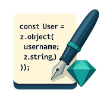

# Zod To Code

 

Generate JavaScript/TypeScript code from Zod schemas — round-trip safe 🌀

[](https://www.npmjs.com/package/@lucaconlaq/zod-to-code)
[](https://www.npmjs.com/package/@lucaconlaq/zod-to-code)
[](https://biomejs.dev)
[](https://vitest.dev)


---

## ✨ What does it do

-  ✍️ The library does one thing and tries to do it well. It enables code generation from `zod` schemas.
-  🧪 It is fully tested.
-  🧱 It supports most Zod types (see [Supported Types](#-supported-types)).
---

## 🚀 Installation

```bash
npm i @lucaconlaq/zod-to-code
```

---

## 📦 Usage

```ts
import { z } from "zod";
import { zodToCode } from "@lucaconlaq/zod-to-code";

const schema = z.object({
  username: z.string(),
});

const code = zodToCode(schema);
console.log(code);
```

Outputs:

```ts
z.object({
  username: z.string()
})
```

---

## 🧩 Supported Types


| Type                             | Status            |
|----------------------------------|-------------------|
| `string`                         | ✅ Supported       |
| `number`                         | ✅ Supported       |
| `boolean`                        | ✅ Supported       |
| `date`                           | ✅ Supported       |
| `bigint`                         | ✅ Supported       |
| `symbol`                         | ✅ Supported       |
| `void`                           | ✅ Supported       |
| `never`                          | ✅ Supported       |
| `unknown`                        | ✅ Supported       |
| `any`                            | ✅ Supported       |
| `object`                         | ✅ Supported       |
| `array`                          | ✅ Supported       |
| `tuple`                          | ✅ Supported       |
| `record`                         | ✅ Supported       |
| `map`                            | ✅ Supported       |
| `set`                            | ✅ Supported       |
| `function`                       | ✅ Supported       |
| `lazy`                           | ✅ Supported       |
| `literal`                        | ✅ Supported       |
| `enum`                           | ✅ Supported       |
| `nativeEnum`                     | ✅ Supported       |
| `union`                          | ✅ Supported       |
| `intersection`                   | ✅ Supported       |
| `or`                             | ✅ Supported       |
| `and`                            | ✅ Supported       |
| `.optional()`                    | ✅ Supported       |
| `.nullable()`                    | ✅ Supported       |
| `.nullish()`                     | ✅ Supported       |
| `.default()`                     | ✅ Supported       |
| `.catch()`                       | ✅ Supported       |
| `.describe()`                    | ✅ Supported       |
| `.readonly()`                   | ✅ Supported       |
| `.brand()`                       | ✅ Supported       |
| `.int()`                         | ✅ Supported       |
| `.email()`                       | ✅ Supported       |
| `.uuid()`                        | ✅ Supported       |
| `.regex()`                       | ✅ Supported       |
| `.url()`                         | ✅ Supported       |
| `.ip()`                          | ✅ Supported       |
| `.datetime()`                    | ✅ Supported       |
| `.emoji()`                       | ✅ Supported       |
| `.refine()`                      | ❌ Not Supported   |
| `.superRefine()`                 | ❌ Not Supported   |
| `.transform()`                   | ❌ Not Supported   |
| `.pipe()`                        | ❌ Not Supported   |
| `z.custom()` (e.g. `Buffer`)     | ❌ Not Supported   |
| Effects with unsupported type    | ❌ Not Supported   |
| Unknown `typeName` (mock types)  | ❌ Not Supported   |
| Non-serializable transforms      | ❌ Not Supported   |
